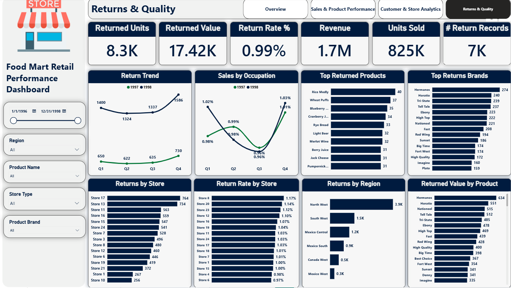

# Food Mart Retail Performance Analytics

**End-to-end retail analytics project** — data cleaning (Python), dimensional data modeling, and an interactive 4-page Power BI dashboard analyzing sales, profitability, customer behavior, and product returns across a multi-region grocery retail chain.


---

## Project Summary

Food Mart is a multi-region grocery retail chain (supermarkets, deluxe supermarkets, gourmet supermarkets, mid-size and small grocery formats) operating across **North West, South West, Central West, Mexico Central, Mexico South, Mexico West, and Canada West** sales regions. Leadership needed a single source of truth to answer four recurring business questions:

1. **How is the business performing overall** — revenue, profitability, and margin trends?
2. **Which products, brands, and price points drive sales and profit** — and which underperform?
3. **Who are our customers and which stores/regions generate the most value?**
4. **Where is the business losing money to returns, and is product quality a risk?**

This project takes raw transactional CSV extracts (sales, returns, customers, products, stores, regions) through **cleaning and preparation in Python/Pandas**, builds a **star-schema data model**, and delivers a **4-page interactive Power BI dashboard** with cross-filtering, KPI cards, and drill-down visuals for each of the four business questions above.

---

## Business Objectives

| # | Objective | Dashboard Page |
|---|-----------|-----------------|
| 1 | Track top-line KPIs (units sold, revenue, gross profit, margin, customers, return rate) at a glance | `Overview` |
| 2 | Identify best/worst performing products, brands, and price-to-profit relationships | `Sales & Product Performance` |
| 3 | Segment customers (demographics, income) and compare store/regional performance | `Customer & Store Analytics` |
| 4 | Monitor returns volume, return rate, and quality issues by product/brand/store | `Returns & Quality` |

---

## Dashboard Preview

### Overview


### Sales & Product Performance


### Customer & Store Analytics


### Returns & Quality


Full page-by-page walkthrough (visuals, filters, and how to read each chart) is documented in **[`docs/dashboard_guide.md`](docs/dashboard_guide.md)**.

---

## Key KPIs (as of latest refresh)

| KPI | Value |
|---|---|
| Units Sold | 825K |
| Revenue (Net Sales Value) | 1.7M |
| Gross Profit | 1.1M |
| Gross Margin % | 59.7% |
| Customers | 8.84K |
| Return Rate % | 0.99% |
| Sales Value per Customer | 199.56 |
| Units per Customer | 94.26 |
| Returned Units | 8.3K |

> Full metric definitions and business interpretation are in **[`docs/kpis_and_insights.md`](docs/kpis_and_insights.md)**.

---

## 🔎 Key Findings

The dashboard surfaces several patterns worth investigating further. The bullets below are **directly observable from the visuals** in this repo's screenshots; deeper causal analysis (why margins differ, why specific stores return more, seasonality drivers, etc.) is flagged as `TODO` for follow-up written analysis.

- **Margins are healthy overall** — a 59.7% gross margin against 1.7M in revenue, but margin/return performance likely varies materially by store type and region (`TODO`: confirm with a margin-by-segment breakdown).
- **Revenue is concentrated in the "Supermarket" format** (44.75% of revenue) and "Deluxe Supermarket" (37.94%), while "Small Grocery" and "Mid-Size Grocery" formats contribute a small share — a footprint/format mix worth reviewing.
- **North West is the leading sales region** (839.5K), roughly 2.6x the next closest region (South West, 317.7K) — regional demand is highly uneven.
- **Return rate is low in aggregate (0.99%)** but returns are concentrated in a handful of brands and stores (e.g., Store 17 and Store 13 show the highest return volumes) — worth a targeted quality/vendor review.
- **Revenue trended upward from Q1 to Q4** in both 1997 and 1998, with Q4 the strongest quarter both years — consistent with seasonal holiday demand (`TODO`: confirm against calendar/promo events if available).
- Customer base is **evenly split by gender (≈50/50) and marital status (≈50/50)**, so demographic skew is not currently a driver of the revenue concentration seen above — the "professional" occupation segment is the largest income-generating group (33.18% of sales).

---

## Repository Structure

```
food-mart-retail-performance-analytics/
├── README.md                          <- You are here
├── LICENSE
├── requirements.txt                   <- Python environment for the cleaning notebook
├── .gitignore
│
├── data/
│   ├── raw/                           <- TODO: place original CSV extracts here (not committed — see data/README.md)
│   ├── processed/                     <- Cleaned Parquet outputs produced by the notebook (not committed — see .gitignore)
│   └── README.md                      <- Data source, licensing, and file inventory
│
├── notebooks/
│   └── 01_data_cleaning_and_preparation.ipynb   <- Ingestion, type-casting, dedup, reference-data fix, Parquet export
│
├── powerbi/
│   ├── Food_Mart_Retail_Performance.pbix        <- Full Power BI file (data model + 4 report pages)
│   └── model_documentation.md                   <- Star schema, relationships, and DAX measures reference
│
├── docs/
│   ├── data_dictionary.md             <- Column-level definitions for every table
│   ├── methodology.md                 <- End-to-end analytical workflow
│   ├── kpis_and_insights.md           <- KPI definitions + business interpretation
│   └── dashboard_guide.md             <- Page-by-page guide to the Power BI report
│
└── assets/
    └── screenshots/                   <- Dashboard and data model screenshots used in this README/docs
```

---

## Data Model

Star schema with **2 fact tables** and **4 dimension tables**, built in Power BI's internal model after cleaning in Python:

- **Fact tables:** `fact sales`, `fact returns`
- **Dimension tables:** `dim date`, `dim products`, `dim stores`, `dim customers`


Full relationship cardinalities, keys, and measure list: **[`powerbi/model_documentation.md`](powerbi/model_documentation.md)**.

---

## Tech Stack

| Layer | Tool |
|---|---|
| Data cleaning & preparation | Python (Pandas, NumPy), Jupyter Notebook |
| Storage format for cleaned data | Parquet |
| Data modeling & DAX measures | Power BI (Power Query + Tabular model) |
| Visualization / reporting | Power BI Desktop (4-page interactive report) |
| Exploratory profiling (optional) | Matplotlib, Seaborn |

---

## Documentation Index

| Document | Purpose |
|---|---|
| [`docs/data_dictionary.md`](docs/data_dictionary.md) | Every table and column, source, type, and description |
| [`docs/methodology.md`](docs/methodology.md) | Step-by-step analytical workflow from raw data to dashboard |
| [`docs/kpis_and_insights.md`](docs/kpis_and_insights.md) | KPI formulas and what each one means for the business |
| [`docs/dashboard_guide.md`](docs/dashboard_guide.md) | How to read and use each dashboard page |
| [`powerbi/model_documentation.md`](powerbi/model_documentation.md) | Data model schema and DAX measure inventory |
| [`data/README.md`](data/README.md) | Data source, provenance, and licensing notes |
